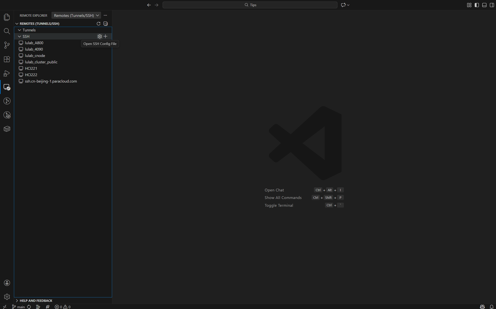
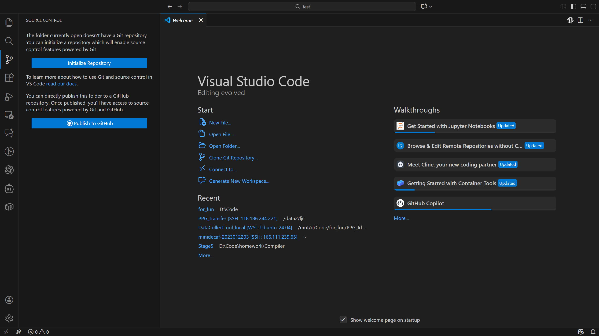
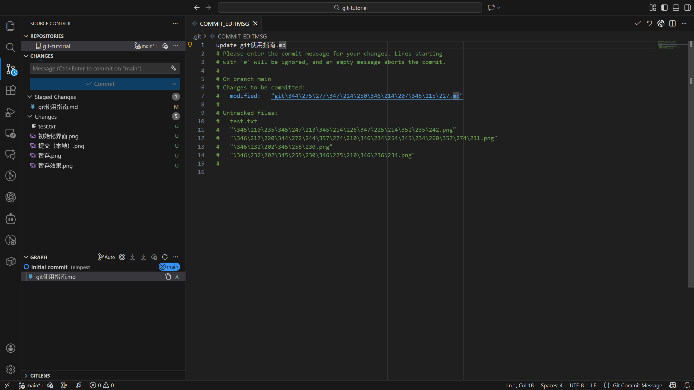
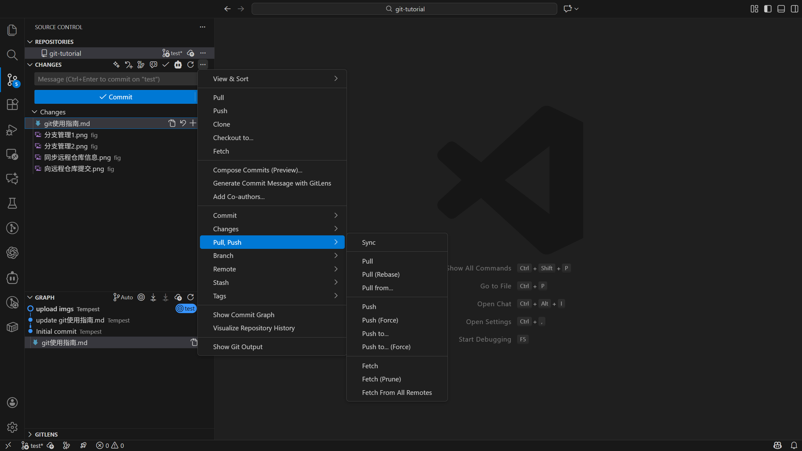
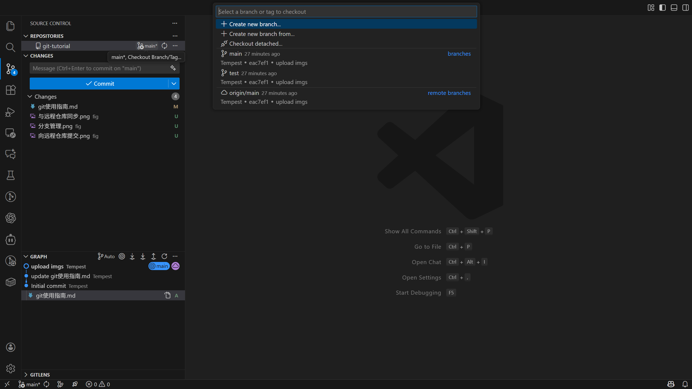
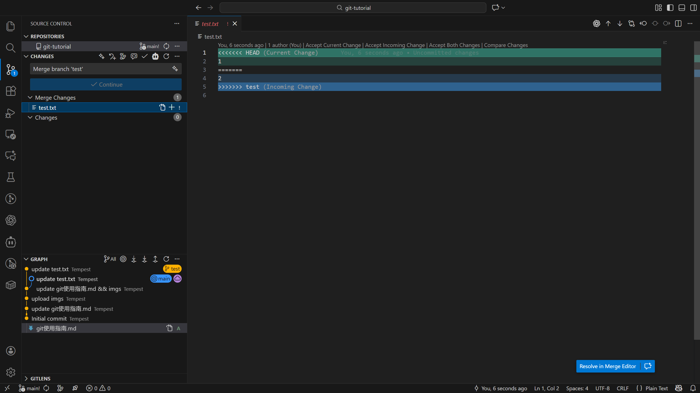
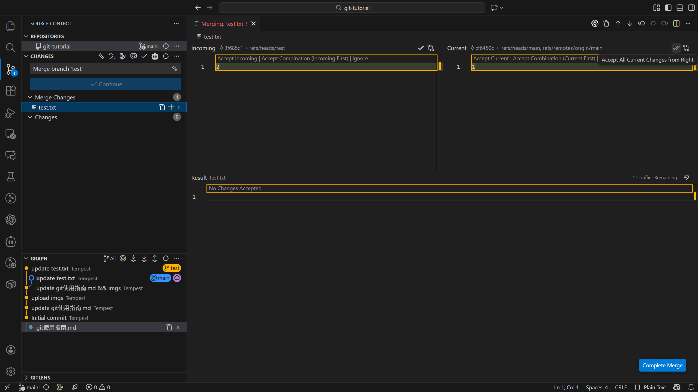

# Tips All You Need to Work Decently

**写在开头的建议：**

- 遇到问题多问 AI，多查官方文档

- 对于 AI 给出的可能造成不可逆后果的建议，保持谨慎

- 如对本文有任何修改建议，欢迎提出 Issue

## Remote Server 使用指南

### SSH

#### 登录

`ssh [-p [Port]] [username]@[server_ip]`

#### 密钥对管理

- generate key pair: `ssh-keygen -t ed25519 [-p [Port]] [-C [email_address](format: "your_email@example.com")]`

- add public key to remote server: `ssh-copy-id [username]@[server_ip]`

  > Only usable in Linux and MacOS system. For Windows user, run this command in WSL is recommended. Before running this command in WSL, remember to check whether your WSL and Windows system share the same key pair files. If your computer system is Windows and you don't have WSL, please hand in your public key to server manager.

> Note (IMPORTANT!): While it's free to share your pulic key (.pub file), DONT share your private key to ANYONE.

#### 结合 VSCode 使用

- 安装 Remote-SSH extension 插件

- 如图，打开 Remote Explorer ，点击 New Remote，按照示例输入 ssh 指令

  

- 如图，可通过点击 Open SSH Config File 并选中 SSH 配置文件进行管理

  

- SSH 配置文件和SSH指令 `ssh [-p [Port]] [username]@[server_ip]` 的对应关系如下：

  ```
  Host server_name(can be modified as you like)
    HostName server_ip
    Port port_num
    User username 
  ```

### Tmux

#### 简介

Tmux 是一款用于管理多个终端会话的命令行工具，它允许用户在一个终端窗口中同时运行和切换多个会话、窗口和面板。通过 tmux，用户可以在断开 SSH 连接后继续保持程序运行状态，随时重新连接继续工作，非常适合远程服务器管理和长期任务执行。

#### 常用指令

- `tmux ls`: 用于查看会话列表

- `tmux new -s [session_name]`: 用于创建特定名称会话

- `tmux attach -t [session_name]`: 用于连接指定名称会话

- `tmux kill-session -t [session_name]`: 用于彻底关闭指定名称会话（会话中的进程被终止）

#### 常用快捷键

- `Ctrl+b d`: 挂起会话（会话中的指令会继续运行）

- `Ctrl+b c`: 新建窗口 

- `Ctrl+b ,`: 重命名窗口

- `Ctrl+b %`: 水平分屏

- `Ctrl+b "`: 垂直分屏

- `Ctrl+b ?`: 查看所有快捷键

> Note: 上述快捷键的使用方式是，先按`Ctrl`，按住不放的同时按下`b`，然后松开这两个键，再按剩下的键

#### 补充建议

- 统一使用`Ctrl+b d`挂起会话，再用`tmux kill-session -t [session_name]`彻底关闭会话，避免误关闭会话导致进程终止（这也是没有上文提供关闭会话的指令的原因）

## GPU Machine 使用指南

### 常用指令

- `nvidia-smi`: 用于查看当前 GPU 使用情况，若想实时监控GPU使用情况，可使用组合指令 `watch -n 1 nvidia-smi`，其中 `-n` 用于指定刷新间隔（以秒为单位）

- `nvcc --version`: 用于查看 CUDA 版本

### 补充建议

- 在使用 GPU 前，检查 GPU 使用情况，避免 `OOM(out of memory)` 报错

- 在下线前，检查 GPU 使用情况，确认自己对 GPU 资源的占用已释放

## VSCode Git 使用指南

### 常用指令

- 初始化git仓库：`git init`

- 向仓库中添加文件：`git add [files]`

- 提交修改：`git commit -m "提交信息"`

- 链接远程仓库：

```bash
  git remote add origin https://github.com/{Username}/{repo_name}.git
  git branch -M main
  git push -u origin main
```

- 克隆远程仓库：`git clone [link]`

- 向远程仓库提交本地修改：`git push`

- 拉取远程仓库代码：`git pull`

- 切换分支：`git checkout [branch_name]`

- 合并分支：`git merge [branch_name]`

- 撤销提交（重置）：`git reset --soft/hard [commitID]`（将当前分支重置到指定 commitID。soft 会将 commitID 后的修改保留在暂存区，hard 则会直接丢弃这些修改，请谨慎使用）

- 撤销指定提交：`git revert [commitID]`（新建一个提交，用来撤销指定 commitID 所做的修改，不影响后续的其他提交）

### VSCode Git 可视化界面常用操作

#### 初始化仓库



点击左上角 Initialize Repository 即可在当前路径下新建一个 git 仓库，相当于 git init.

#### 暂存


点击加号即可暂存指定文件


注：当暂存区存在文件时，提交时仅有暂存区的文件会被提交；暂存区为空时，VSCode 会询问是否提交未被暂存的文件（可通过设置令 VSCode 遇到该类情况不再询问，直接提交发生修改的所有文件）

#### 提交（本地）


在输入提交信息后点击 Commit 即可提交修改，或者先点击 Commit，之后会跳出填写提交信息的界面，填写内容后点击右上角的 "√" 即可提交修改



#### 向远程仓库提交


点击 Sync Changes 即可

#### 同步远程仓库信息


点击 synchronize changes （首尾相接的箭头图标）即可



点击 Pull 即可

#### 分支管理


- 分支切换：

  

- 分支合并：

  

- 分支合并冲突处理：

  

  点击右下方 Resolve in Merge Editor 进入合并冲突处理界面

  

  可以选择保留当前分支的版本还是引入将要合并进来的分支的版本

  

  点击 Complete Merge 完成分支合并冲突处理

### 补充建议

- 如果不想让 git 追踪当前目录及子目录下的部分文件，可以编写 `.gitignore` 文件，该文件内的所有内容都不会被 git 追踪。

- 一般来说，github 远程仓库上不建议存放太大的文件。

## Slurm 使用指南

**TODO**
