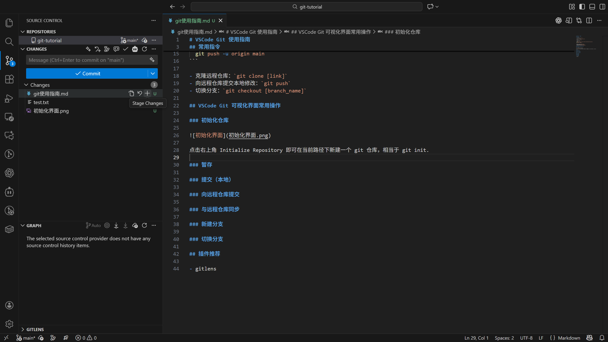
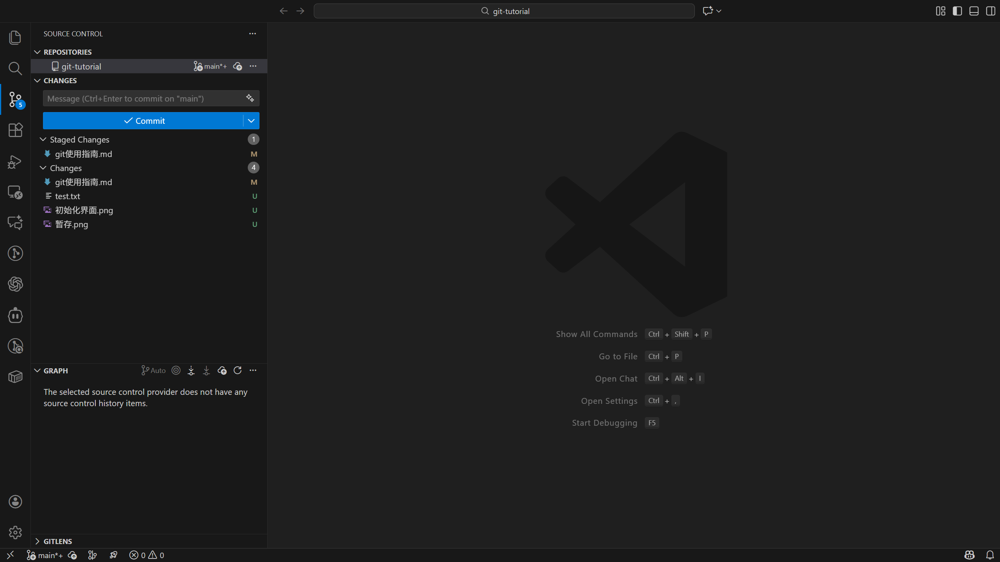
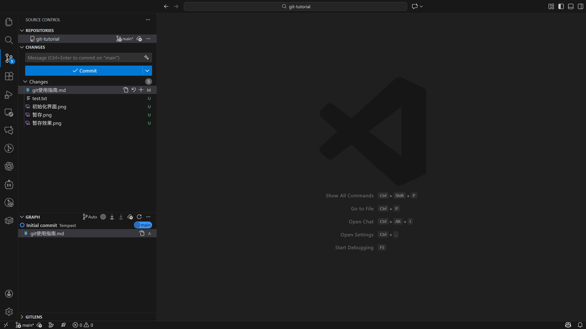
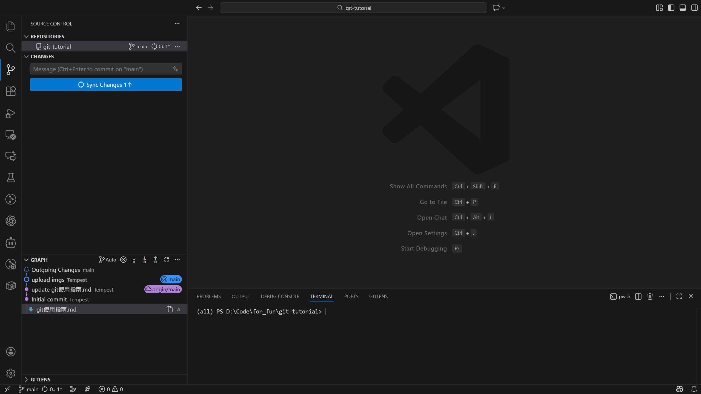
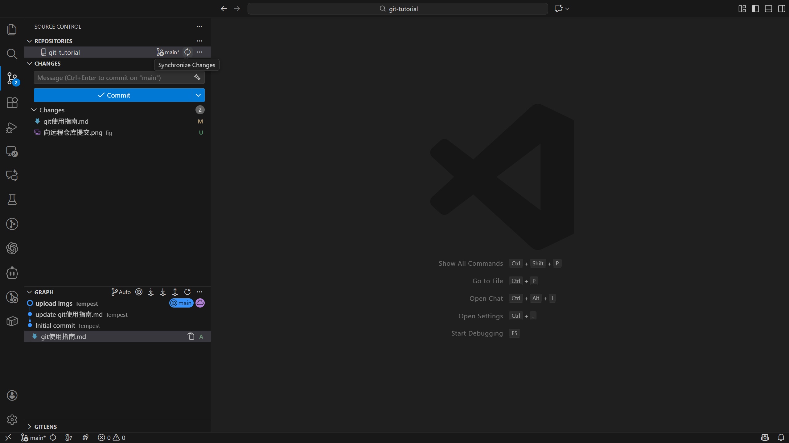
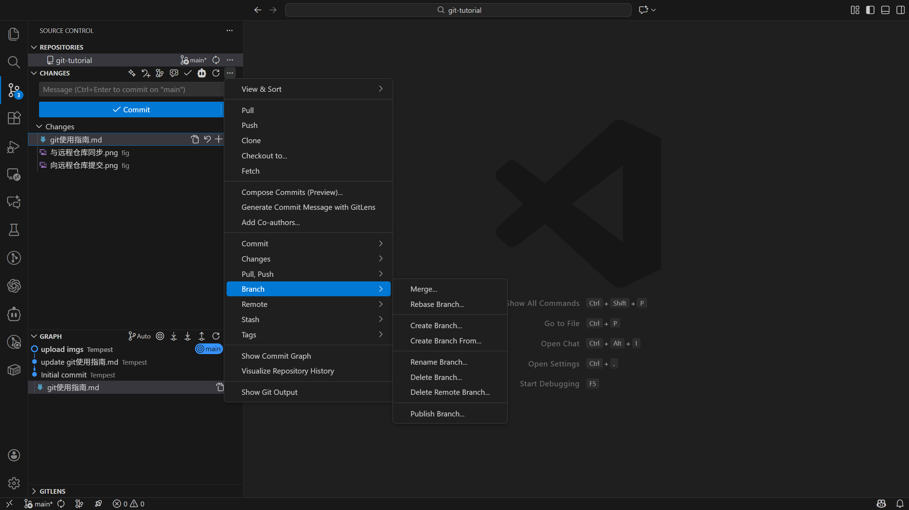

# VSCode Git 使用指南

## 常用指令

- 初始化git仓库：`git init`

- 向仓库中添加文件：`git add [files]`

- 提交修改：`git commit`

- 链接远程仓库：

```bash
  git remote add origin https://github.com/{Username}/{repo_name}.git
  git branch -M main
  git push -u origin main
```

- 克隆远程仓库：`git clone [link]`

- 向远程仓库提交本地修改：`git push`

- 拉取远程仓库代码：`git pull`

- 切换分支：`git checkout [branch_name]`

- 合并分支：`git merge [branch_name]`

- 撤销提交：`git reset --soft/hard [commitID]`（soft 会保留 commitID 后的所有修改，hard 则不会）

- 回退版本：`git revert [commitID]`（创建一次新的提交，经过该次提交，代码回退到 commitID 对应的代码版本）

## VSCode Git 可视化界面常用操作

### 初始化仓库


点击左上角 Initialize Repository 即可在当前路径下新建一个 git 仓库，相当于 git init.

### 暂存





注：当暂存区存在文件时，提交时仅有暂存区的文件会被提交；暂存区为空时，VSCode 会询问是否提交未被暂存的文件（可通过设置令 VSCode 遇到该类情况不再询问，直接提交发生修改的所有文件）

### 提交（本地）



在输入提交信息后点击 Commit 即可提交修改，或者先点击 Commit，之后会跳出填写提交信息的界面，填写内容后点击右上角的 "√" 即可提交修改


### 向远程仓库提交



点击 Sync Changes 即可

### 同步远程仓库信息/c



点击 synchronize changes （首尾相接的箭头图标）即可


点击 Pull 即可

### 分支管理




## 补充内容

- 如果不想让 git 追踪当前目录及子目录下的部分文件，可以编写 `.gitignore` 文件。

- 以上内容只是 git 完整功能的一小部分，在实际使用过程中如果遇到问题，建议向 AI 寻求帮助，对于 AI 给出的可能造成 git 记录丢失的操作，请保持谨慎。

- 一般来说，github 远程仓库上不建议存放太大的文件。